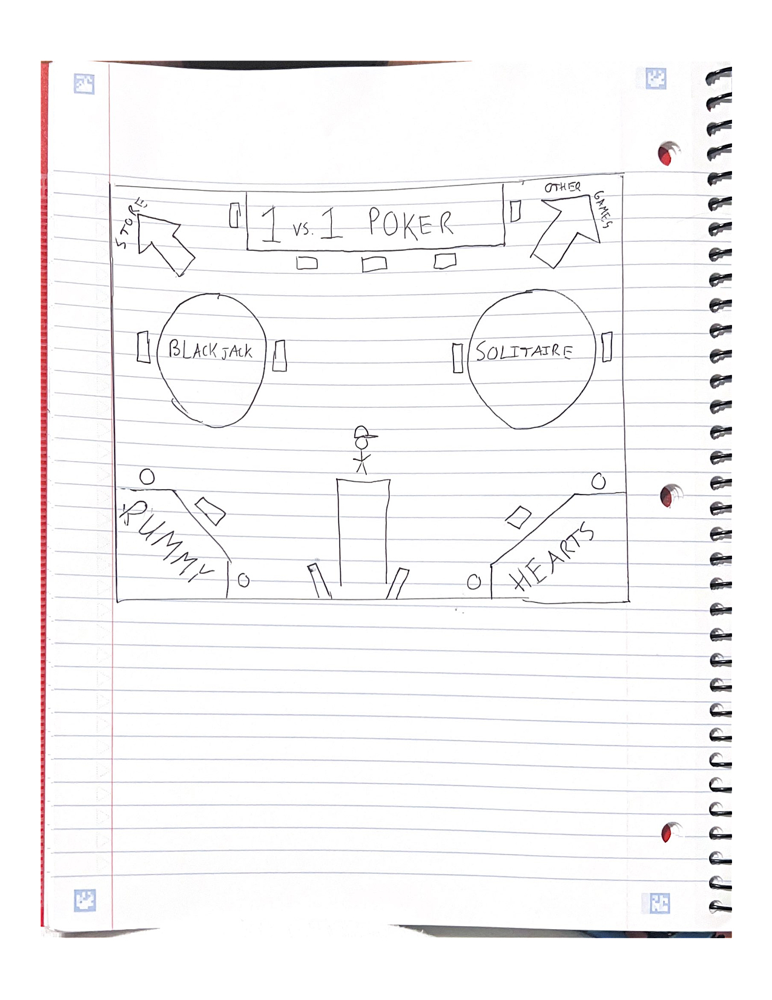

## Project Name 
 CS110 Blackjack Project | Fall, 2024
## Team Members
Connor Basile
***

## Project Description
I am creating a game that is close to a replica of Blackjack. A player can do the basic controls of hit and stand. Manages the win scenarios
between Dealer and Player accordingly. The Player is able to bet for each hand in increments of 2. If they win, they double their bet, if they
lose, their bet goes away. The objective of the game is to get to 40 coins, but the PLayer can play until their coins are gone. If the Player
loses all of their coins, the windows shits, indicating that they have lost the game.

***    

## GUI Design

### Initial Design

### Final Design

## Program Design

### Features

1. << Moveable Cards >>
2. << Arithmetic Functions >>
3. << Main Menu Screen >>
4. << Game Results Screen >>
5. << Manage Bets and Win Money >>

### Classes

- << You should have a list of each of your classes with a description >>
Card Class:
Represents an Individual Card in a Deck of card, for a game of blackjack. 
Instance Variables include the cards Suit(String) and its Rank(String).
Is especially helpful in identifying the correct image to use in animation. Image found using  f"assets/{self.rank}_of_{self.suit}.png"
    Methods:
    def __init__(self, rank, suit): The constructor method initializes the card with a rank and a suit. Assigns image to card
    def get_value(self): This method determines the card's value based on its rank. 
Returns: The integer value of the card used in the game logic.
Controller Class:
Responsible for managing the flow of the game. It acts as the bridge between the user interface (UI) and the game logic. It handles different states of the game, updates the screen, processes user input, and controls the progression of the game.
    Instance Variables:
    self.screen - Surface where the game is drawn
    self.font - The font used to render text on screen
    self.state - str: String representing current state of game
    self.player - Player:An instance of the Player class
    self.dealer - Dealer: An instance of the Dealer class
    self.deck - Deck: An instance of the Deck class
    self.bet_amount - int: Amount being bet on a game
    self.result - string: String result of the game
    self.back_card_image - Back image of the card, used by dealer
    Methods: 
    __init__(self, screen, font) - Initializes the game state, creates the player, dealer, and deck, and loads the back card image
    mainloop(self) - Checks games state and transitions in between states
    menuloop(self) - Loop for the main menu screen
    press_d_to_deal(self) - Screen loop that prompts the Player to initiate the deal
    start_game(self) - Initializes the deck, shuffles it, and resets the player and dealer
    gameloop(self) - main loop where player can hit or stand
    animate_deal(self) - Animates the cards being dealt to Player and Dealer in the beginning of game
    dealer_move(self) - Loop where Dealer plays
    check_winner(self) - Checks the winner of the game
    gameoverloop(self) - Displays the result of the game (win, loss, or tie) and asks the player to restart the game or quit
    animate_card_deal(self, card, target_player) - Animates a card being dealt to a player
    animate_dealer_card(self, card) - Shows card being dealt to the Dealer
Dealer Class:
Responsible for managing the dealer's hand, calculating the total value of the hand, updating the hand when cards are dealt, and handling game logic related to the dealer's actions, such as resetting the hand for a new round.
    Instance Variables:
    self.hand - Represents the cards that the dealer holds, List
    self.total - int: the total of all the cards in the dealers hand
    Methods:
    __init__ - Initializes the dealer's hand as an empty list and sets the total score to 0
    add_card(self, card) - Adds a card object to dealers hand 
    calculate_total(self) - Calculates the total of the hand
    reset(self) -  Resets hand for next game
    update_total(self) - Updates the total after a card has been added
Deck Class:
Represents a standard deck of 52 playing cards. It handles the creation, shuffling, and dealing of cards.
    Instance Variables: 
    self.cards - list: the cards that are in the deck
    Methods:
    __init__(self) - Initializes the Deck with an empty card list
    create_deck(self) - Generates deck of 52 cards
    shuffle_deck(self) - Shuffles the deck
    deal_card(self) - Deals a card to the according player

Player Class:
Represents a player in the game, manages the player's hand of cards, score, and coin amount.
    Instance Variables: 
    self.name - str: Name of the player
    self.hand - list: Cards currently in Players hand
    self.total - int: Value of all the cards in Players hand
    self.coins - int: Number of coins the Player has

Other Methods: 
    draw_hand(screen, hand, x, y, font) - screen: Surface, hand: list of card objects, x: x-coordinate, y: y-coordinate, font: font used to render text
        Loads images and draws it at specifed position
    draw_coins(screen, coins, x, y, font)
        Loads coin and draws it at the right position
    draw_status(screen, text, y, font)
        Draws status message to screen
    draw_bet(screen, bet_amount, x, y, font) - bet_amount: the amount gambled by player
        Shows bet amount on screen
    draw_total(screen, total, x, y, font)
        Displays players and dealers total
    draw_instruction(screen, message, y, font)
        Shows important messages
## ATP

| Step                 |Procedure             |Expected Results                   |
|----------------------|:--------------------:|----------------------------------:|
|  1                   | Press Enter to Start the Game  |The Game transitions into the game menu  |
|  2                   | Press Up Arrow or Down Arrow | Changes the bet amount in increments of 2 |
| 3                   |  Press D       |     The cards are dealt to the player and dealer     |
|  4                   | Press H or S | H gives the player another card, until S stops the players turn |
| 5                    | Player Busts | Manage bets accordingy, and go to step 7 |
|  6                   | Dealer Turn  | The Dealer deals cards to itself until it has a total of 17 or above |
|  7                   | Game Results | Shows the results of the game on the screen | 
| 8                    | Check currency | If >0, display "Press Enter to Restart", if coin amount = 0, close the window|
| 9                    | Press Enter    | Brings you back to step 2, the "main menu" |
etc...
